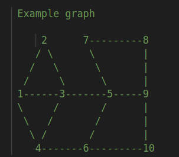

# TODO

1. Graph Coloring Dataset [OR-Library](http://people.brunel.ac.uk/~mastjjb/jeb/orlib/colourinfo.html)
2. Read up on [A New Technique For Distributed Symmetry Breaking
](https://www.researchgate.net/publication/221344365_A_New_Technique_For_Distributed_Symmetry_Breaking)
3. Look into [Graph Contraction](https://en.wikipedia.org/wiki/Graph_coloring#:~:text=sparse%20graphs%5B14%5D.-,Contraction,-%5Bedit%5D)
4. Look into [Heuristic algorithms](https://en.wikipedia.org/wiki/Graph_coloring#:~:text=of%20a%20graph.-,Heuristic%20algorithms,-%5Bedit%5D)
4. Look into [Exact algorithms](https://en.wikipedia.org/wiki/Graph_coloring#:~:text=Exact%20algorithms%5Bedit%5D)
    - [Brute-force search](https://en.wikipedia.org/wiki/Brute-force_search)
    - [Dynamic programming](https://en.wikipedia.org/wiki/Dynamic_programming)
5. Look into focusing on an application
    - Register Allocation
    - Map Coloring
    - Bipartite Graph Checking
    - Mobile Radio Frequency Assignment
    - Making timetables, etc.
    - N Queens, Sudoku, Placing n rooks


# Graph Coloring
Graph coloring is computationally hard. It is NP-complete to decide if a given graph admits a k-coloring for a given k except for the cases k ∈ {0,1,2} . In particular, it is NP-hard to compute the chromatic number. The 3-coloring problem remains NP-complete even on 4-regular planar graphs.[27] However, for every k > 3, a k-coloring of a planar graph exists by the four color theorem, and it is possible to find such a coloring in polynomial time.

# Getting Started

Compilation on Linux:
```
make
```
Usage:
```
./bin/WelshPowell < input.txt > outputSerial.txt
./bin/BruteForceSerial < input1.txt > outputParallel.txt
./bin/BruteForcePThread < input1.txt > outputParallel.txt
./bin/BruteForceCUDA < input1.txt > outputParallel.txt
```

Or run the test script
```
./test.sh
```

# Mapping from Number Of Colours and Index i to Color Combination

When distributing the task across multiple cores, it is necessary to have mapping from `CORE_ID` to `SUBPROBLEM_ID`

```python
# Look at p2i.py
>>> v = 3 # Number of vertices 
>>> for c in range(1, v+1):
>>>     print('colors : ', c)
>>>     for i in range(c**v):
>>>         print(' ', 'index : ', i, '\t->', [c,i] ,'->\t', dec_to_base(i, c).zfill(v))
colors :  1
  index :  0 	-> [1, 0] ->	 000
colors :  2
  index :  0 	-> [2, 0] ->	 000
  index :  1 	-> [2, 1] ->	 001
  index :  2 	-> [2, 2] ->	 010
  index :  3 	-> [2, 3] ->	 011
  index :  4 	-> [2, 4] ->	 100
  index :  5 	-> [2, 5] ->	 101
  index :  6 	-> [2, 6] ->	 110
  index :  7 	-> [2, 7] ->	 111
colors :  3
  index :  0 	-> [3, 0] ->	 000
  index :  1 	-> [3, 1] ->	 001
  index :  2 	-> [3, 2] ->	 002
  index :  3 	-> [3, 3] ->	 010
  index :  4 	-> [3, 4] ->	 011
  index :  5 	-> [3, 5] ->	 012
  index :  6 	-> [3, 6] ->	 020
  index :  7 	-> [3, 7] ->	 021
  index :  8 	-> [3, 8] ->	 022
  index :  9 	-> [3, 9] ->	 100
  index :  10 	-> [3, 10] ->	 101
  index :  11 	-> [3, 11] ->	 102
  index :  12 	-> [3, 12] ->	 110
  index :  13 	-> [3, 13] ->	 111
  index :  14 	-> [3, 14] ->	 112
  index :  15 	-> [3, 15] ->	 120
  index :  16 	-> [3, 16] ->	 121
  index :  17 	-> [3, 17] ->	 122
  index :  18 	-> [3, 18] ->	 200
  index :  19 	-> [3, 19] ->	 201
  index :  20 	-> [3, 20] ->	 202
  index :  21 	-> [3, 21] ->	 210
  index :  22 	-> [3, 22] ->	 211
  index :  23 	-> [3, 23] ->	 212
  index :  24 	-> [3, 24] ->	 220
  index :  25 	-> [3, 25] ->	 221
  index :  26 	-> [3, 26] ->	 222

```

# Testing Serial vs pThread Implementation

Given an input graph of 8 nodes, the serial version takes 24 seconds and the pThread implementation takes under 2 seconds. A massive 12x speedup (for 8 node graphs).

```bash
$ time ./bin/BruteForceSerial < test_graphs/inputs/input5.txt
min_colors: 2

real	0m24.675s
user	0m24.661s
sys	0m0.009s
$ time ./bin/BruteForcePThread < test_graphs/inputs/input5.txt
[TM]	Creating thread 0 
[TM]	Creating thread 1 
[TM]	Creating thread 2 
[TM]	Creating thread 3 
[TM]	Creating thread 4 
[TM]	Creating thread 5 
[TM]	Creating thread 6 
[TM]	Creating thread 7 
[T3]	 min=2
[T5]	 min=2
[T1]	 min=3
[T4]	 min=2
[T2]	 min=3
[T7]	 min=3
[T0]	 min=3
[ll] Stopped thread 0 
[ll] Stopped thread 1 
[ll] Stopped thread 2 
[ll] Stopped thread 3 
[ll] Stopped thread 4 
[ll] Stopped thread 5 
[T6]	 min=2
[ll] Stopped thread 6 
[ll] Stopped thread 7 

real	0m1.403s
user	0m10.645s
sys	0m0.004s
```

## Graph Coloring using Welsh Powell algorithm

Welsh Powell algorithm is a greedy technique to solve the graph coloring problem

### Algorithm
```
0. Define X=0
1. Find the degree of each vertex
2. List the vertices in order of descending degrees.
3. Colour the first vertex with color X.
4. Move down the list and color all the vertices not connected to the coloured vertex, with the same color.
5. X=X+1
6. Repeat step 4 on all uncolored vertices with a new color, in descending order of degrees until all the vertices are coloured.
```

#### Sample input:
<p align="center">
    
</p>

```
0 1 1 1 0 0 0 0 0 0 
1 0 1 0 0 0 0 0 0 0 
1 1 0 1 1 0 0 0 0 0 
1 0 1 0 0 1 0 0 0 0 
0 0 1 0 0 1 1 0 1 0 
0 0 0 1 1 0 0 0 1 1 
0 0 0 0 1 0 0 1 0 0 
0 0 0 0 0 0 1 0 1 0 
0 0 0 0 1 0 0 1 0 1 
0 0 0 0 0 1 0 0 1 0
```

#### Sample output:
```
C:color 1
F:color 1
G:color 1
K:color 1
E:color 2
A:color 2
J:color 2
L:color 2
D:color 3
B:color 3
Graph full colored
```

## Graph Coloring using Brute Force

Brute force looks at all possible colour combinations that a graph can have. Note that a graph with N verticies will have a maximum of N colors, this will be the upper bound.

### Algorithm
```
0. Set num_colors to N
1. Try all valid coloring combinations with a max N colors
2. If at least one valid combination is found, save num_colors to be the min
3. Decrement num_colors
4. If num_colors>0 goto 0. Else exit
```

#### Sample input:

```
0 1 1 0
1 0 1 0
1 1 0 0
0 0 0 0
```

#### Sample output:
```
min_colors: 3
```
